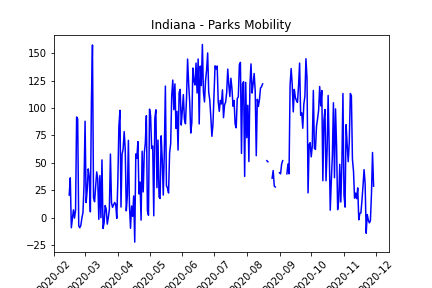
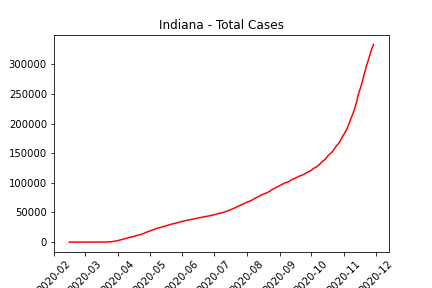
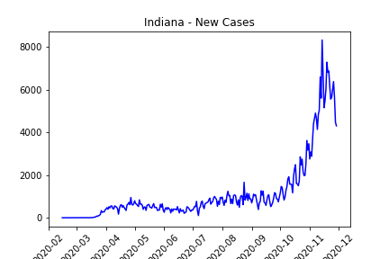

# ETL-Project-Group5

## Question:
How does the number of COVID-19 cases affect community mobility to parks in Indiana?

## Analysis
The datasets used for this analysis are mobility statistics from Google Maps, and John's Hopkins data of new COVID-19 cases per day. These datasets were then transformed to see how the rise of new cases of COVID per day affect parks in Indiana. The graphs help visualize the rise in new cases versus mobility to parks. The data shows that since the beginning of COVID-19 cases, visits to parks in Indiana have increased from the baseline. Keep in mind this data could be affected by weather, day of the week, and other factors.
Here are our graphs:   

## Datasets:
Google Community Mobility Reports 
 [Google Mobility](https://www.google.com/covid19/mobility)

CDC - Indiana New Cases Report - "IN_COVID.csv"
[CDC Covid Data](https://covid.cdc.gov/covid-data-tracker/?CDC_AA_refVal=https%3A%2F%2Fwww.cdc.gov%2Fcoronavirus%2F2019-ncov%2Fcases-updates%2Fcases-in-us.html#trends_dailytrendscases)

Johns Hopkins COVID-19 Case Tracker 
[Johns Hopkins COVID-19 Tracker](https://data.world/associatedpress/johns-hopkins-coronavirus-case-tracker)

## Steps:

### Extract:
* Mobility report - "2020_US_Region_mobility_Report.csv"
    * This dataset was chosen due the vast amount of data across the globe collected from Google Maps. The mobility data will help us compare movement to specific public locations in correlation to the number of cases of COVID-19, which will be extracted from another data source.
    * Loaded into Jupyter notebook to use pandas and clean data.
* Indiana New Cases Report - "IN_COVID.csv"
    * We chose this dataset from the CDC by selecting Indiana and downloading the csv file that shows new cases compared to 7 day moving average by date. The reason we selected this dataset was to compare the data to our Google mobility dataset. We hope to compare cases and where people were going to see if there is a correlation or a causation to the rise in cases.
    * Loaded into Jupyter notebook ot use pandas to clean the data.
    * Ended up not needing this dataset, but loaded it into PgAdmin just in case.
* Indiana Cases by Johns Hopkins - "cases.csv"
    * We chose this dataset from data.world from Johns Hopkins by downloading the csv file with by date data for the US. Our hope is to compare this as well to our Google mobility dataset to see if there is a correlation between rise and cases and mobility.
    * Loaded into Jupyter notebook

### Transform:
* Mobility report (See file titled "google_data"):
     * Rename columns without spacing so postgres database can read columns
    * Drop all unnecessary columns that make data harder to read
    * Filter down to just Indiana in the state column
    * drop rows with blank counties - we ended up not using counties. 
     * Change the date column datatype of object to datatime64 so it will work as the primary key in postgres
    * Reset the index to the date column
    * Used grouby function with the dates to get the averages for each column using the GroupBy `.mean()` function
    * Create a connection to the postgres database to export the new dataframe 
* COVID Cases by Johns Hopkins (See file titled "dataset_IN_johnshopkins"):
    * pull only the Indiana data from the dataset and create a new DataFrame
    * Rename columns for readability
    * Drop columns that were not needed
        * We chose to drop the 7-day rolling averages columns, just because we did not find it to be relevant to our end goal.
    * Changes date data type to datatime64 format so that is would be uniform across all datasets, and to be able to set it as our primary key for our postgres tables.
    * Set DataFrame index to the Date
    * Loaded it into PostgresSQL database. 

### Load:   
* load transformed data frames into Postgresql database:
    * Indiana Cases by Johns Hopkins - load DataFrame into table "in_cases"
    * Mobility report - load data frame into table "mobility_per_date"
* In Postgres we made the date our primary key to simplify our joins.
* We did a couple different joins to examine the data.
    * See our file titled 'schema.sql' to view our queries. 
* Postgresql was chosen because:
    *  Data is transactional - by date, population, number of cases
    *  Data is already structured in csv files
    *  End user can easily combine data however they need